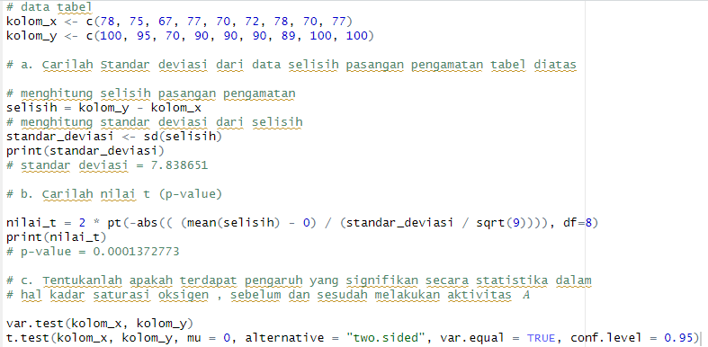

## 1. Seorang peneliti melakukan penelitian mengenai pengaruh aktivitas 𝐴 terhadap kadar saturasi oksigen pada manusia. Peneliti tersebut mengambil sampel sebanyak 9 responden. Pertama, sebelum melakukan aktivitas 𝐴. Kedua, setelah melakukan aktivitas 𝐴.
H0: "tidak ada pengaruh yang signifikan secara  statistika dalam hal kadar saturasi oksigen sebelum dan sesudah melakukan aktivitas 𝐴"
 

 
Didapatkan p-value lebih kecil dari tingkat signifikansi sehingga H0 ditolak dan H1 diterima. Dapat disimpulkan bahwa aktivitas A memberikan pengaruh signifikan dalam kadar saturasi oksigen.

## 2. Diketahui bahwa mobil dikemudikan rata-rata lebih dari 25.000 kilometer per tahun. Untuk menguji klaim ini, 100 pemilik mobil yang dipilih secara acak diminta untuk mencatat jarak yang mereka tempuh. Jika sampel acak menunjukkan rata-rata 23.500 kilometer dan standar deviasi 3.000 kilometer.
H0: rata-rata <= 25000
 
H1: rata-rata > 25000

### a - c
Setuju. Nilai p-value lebih kecil dari alfa, sehingga H0 diterima. Maka, tidak ada bukti yang cukup bahwa mobil dikemudikan rata-rata kurang dari sama dengan 25000 kilometer per tahun. Klaim bahwa mobil dikemudikan rata-rata lebih dari 25000 kilometer per tahun diterima.

## 3. Diketahui perusahaan memiliki seorang data analyst yang ingin memecahkan permasalahan pengambilan keputusan dalam perusahaan tersebut. Didapatkanlah data dari perusahaan saham tersebut. Dari data, berilah keputusan serta kesimpulan yang didapatkan. Asumsikan nilai variancenya sama, apakah ada perbedaan pada rata-ratanya (α= 0.05)?
### a
H0 : mean_bdg = mean_bali
 
H1 : mean_bdg != mean_bali
### b-d

### e-f
Karena p-value lebih besar dari alfa, maka H0 diterima. Tidak ada bukti yang cukup bahwa rata-rata saham Bandung tidak sama dengan rata-rata saham Bali. Klaim bahwa rata-rata saham Bandung sama dengan rata-rata saham Bali diterima.

## 4. Data yang digunakan merupakan hasil eksperimen yang dilakukan untuk mengetahui pengaruh suhu operasi (100˚C, 125˚C dan 150˚C) dan tiga jenis kaca pelat muka (A, B dan C) pada keluaran cahaya tabung osiloskop. Percobaan dilakukan sebanyak 27 kali dan didapat data sebagai berikut:

